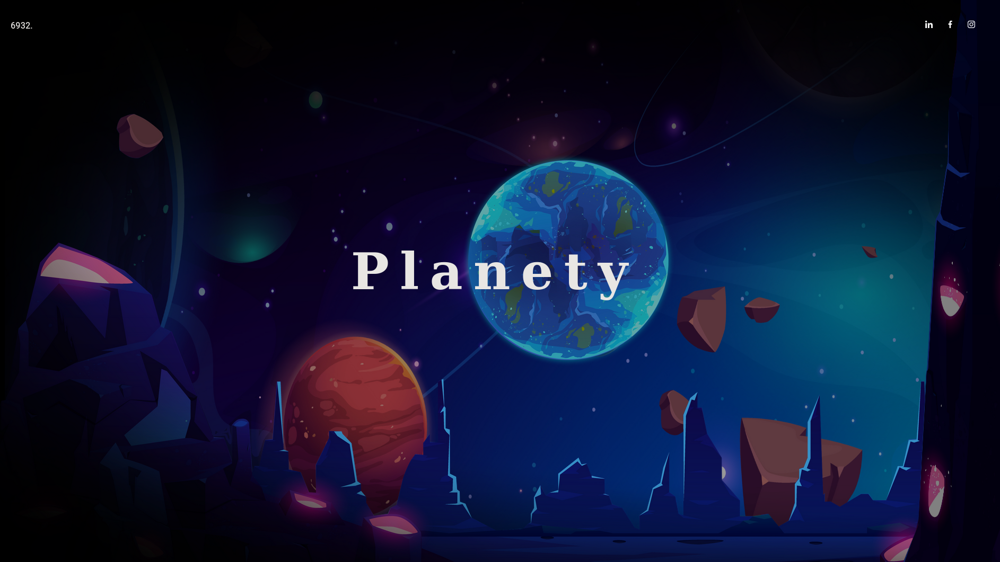
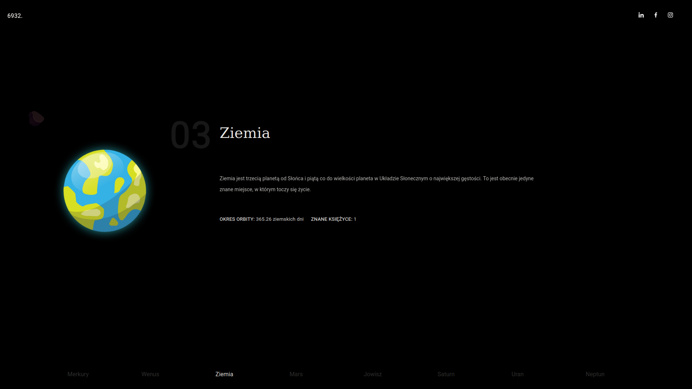

# Solar-Sys-Info-Website

Final project for web development subject. 
The project presents some information about the planets in our solar system.

Check This Out! :earth_africa:

<a href="https://planety-sebastianskowron.netlify.app/" target="blank_">planety-sebastianskowron</a>

</img>
</img>

### Technologies used: 
- HTML, 
- CSS, 
- JS, 
- GSAP, 
- Parallax.js. 

### Hope You Like It! :smile:
